## 目錄

- [導言](#導言)
- [該用哪種編輯器](#該用哪種編輯器)
- [新醫療科網首頁](#新醫療科網首頁)
- [編輯醫療科首頁步驟](#編輯醫療科首頁步驟)
-  [新醫療團隊頁面](#新醫療團隊頁面)
- [編輯醫療團隊資料步驟](#編輯醫療團隊資料步驟)
- [最新公告衛教文章](#最新公告衛教文章)
- [編輯公告與衛教文章](#編輯公告與衛教文章)
- [五大超級無敵重要提醒](#五大超級無敵重要提醒)
# 慈院醫療科網整併與維護
---
作者：曾建瑋(花蓮慈院公共傳播室)，2025.05.01
## 導言、整併醫療科網目標
- 目標
	- 減少管理成本：帳密、網站空間、套件安裝、資安防護
	- 改變：新聞公告在科網顯示、醫師資料易管理、即時顯示
	- 舊科網：資料封存不再更新

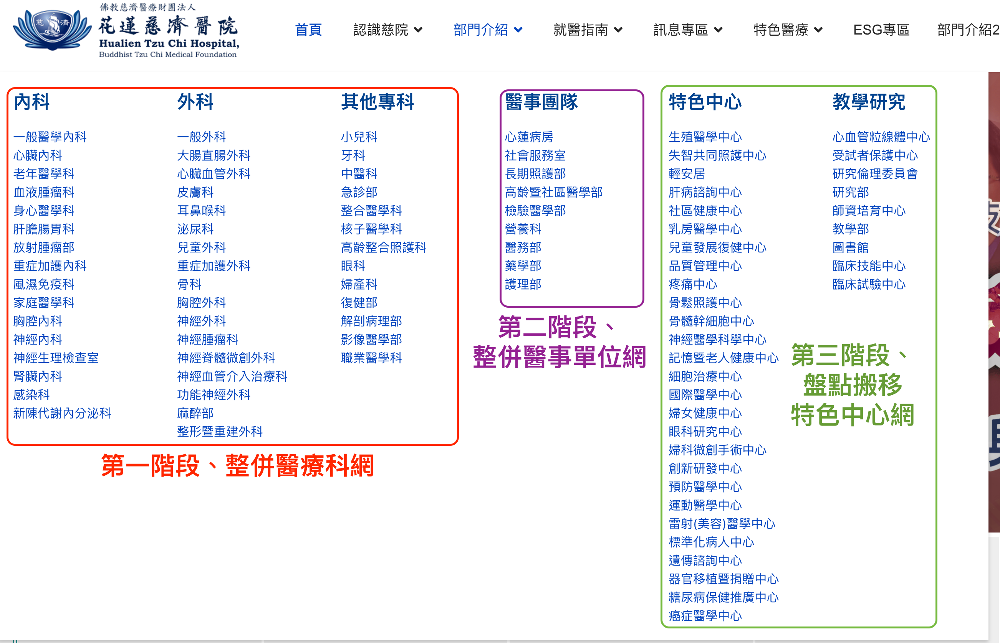
教學三大重點，醫療科網為例
- 更新醫療科首頁
- 更新醫師資料
- 發佈醫療科新聞、公告、衛教

---
## 該用哪種編輯器
- 醫療科首頁：元件-> SP Page編輯器
- 醫師團隊、公告和衛教文章：內容->JCE編輯器
---
## 新醫療科網首頁
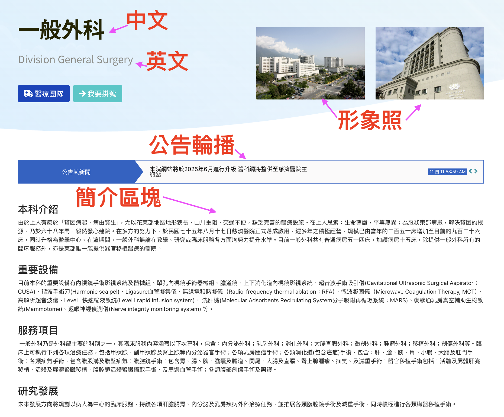

---
## 編輯醫療科首頁步驟
- 用SP Page編輯器更新醫療科首頁。(元件->SP Page Buider->Pages)
- 篩選分類「醫療科」->點選該科的「前端編輯器」
- 形象照請存路徑：images/00MD/medical_team，照片尺寸：900 * 600px。
- 簡介區塊段落內容可自行調整。
- 編輯內容存檔前，請一定要清除「多餘格式」。
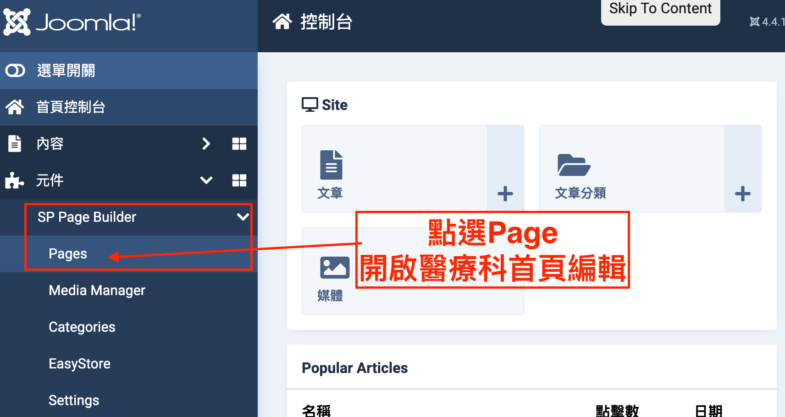
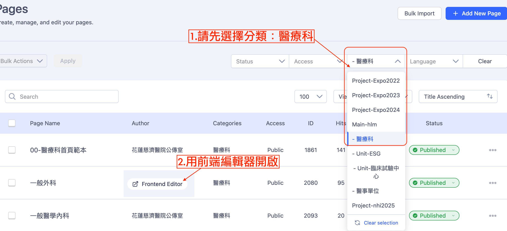

---
## 新醫療團隊頁面

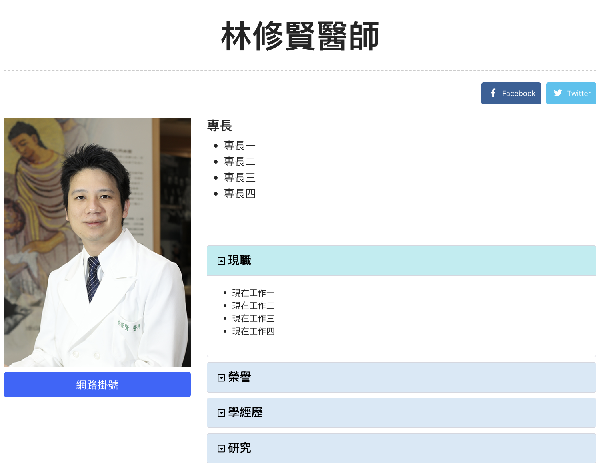

---
## 編輯醫療團隊資料步驟
- 醫師資料更新，步驟如下 (以下用林修賢醫師為例)
	- 內容->文章->篩選->分類(醫療科名稱)->標籤(00-醫師)
	- 用醫師姓名來尋找檔案。
	- 確認醫師照片排列縮圖：點選「圖片與連結」
	- 開啟檔案後選->SP Page Builder->Edit with Frontend Editor(再次輸入帳密)
	- 醫師照片路徑：images/00MD/dr/醫師編號.jpg
	- 網路掛號：?dtno=醫師編號
	- 更新醫師資料，存檔前要按下「清除多餘格式按鈕」
	- 重要：最後要儲存並且關閉檔案(避免檔案鎖死，他人無法編輯)
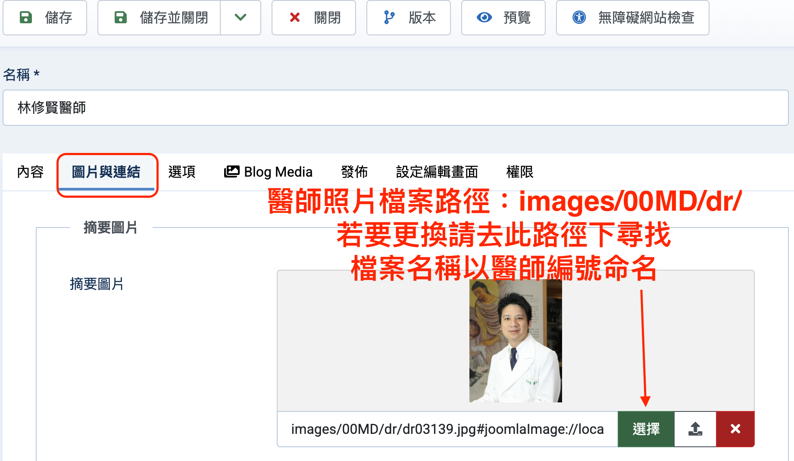
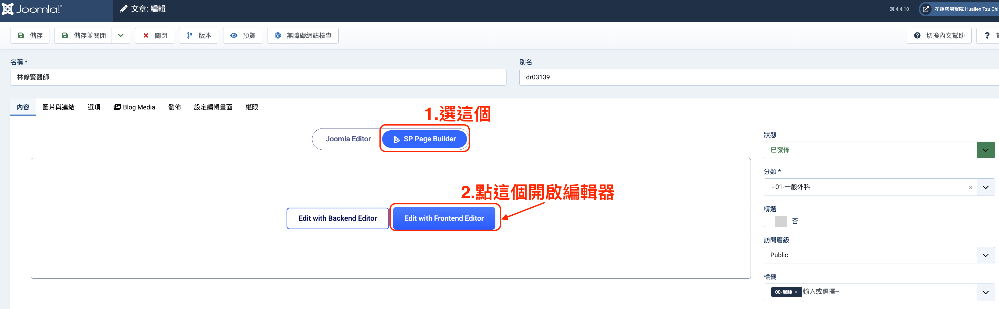
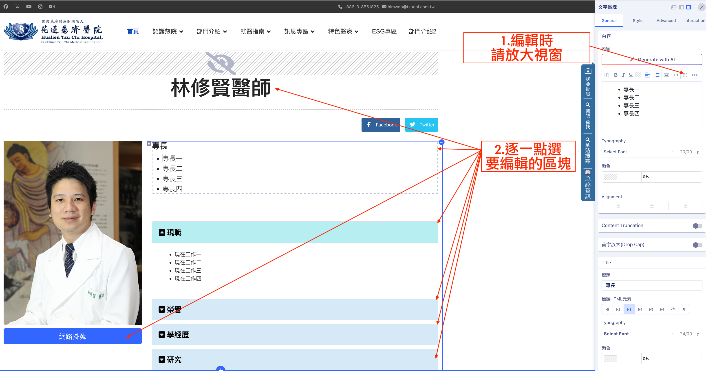
- 若找不到醫師檔案，請依以下步驟來新增醫師資料：
	- 內容->文章->篩選->分類(醫療科名稱)->標籤(00-醫師)
	- 按「新建」->名稱(OOO醫師)->別名(dr醫師編號)->分類(醫療科名稱)->標籤(00-醫師)->選「SP PageBuilder」->直接先按「儲存」
	- 完成上述步驟後，按「Edit With Frontend Editor」->點選右上角「...」按鈕->Export，將以下[醫師資料範例JSON檔](https://drive.google.com/file/d/1oBwWFhSFFyXtu0lAE-Z4JE9h6cTzBJcY/view?usp=sharing)匯入。
	- 匯入檔案後，依照前一階段編修資料方式進行更新後，再存檔退出。
	- 提醒：醫師照片統一路徑是images/00MD/dr/ （檔案名稱是dr+醫師編號.jpg）(公傳統一上傳)
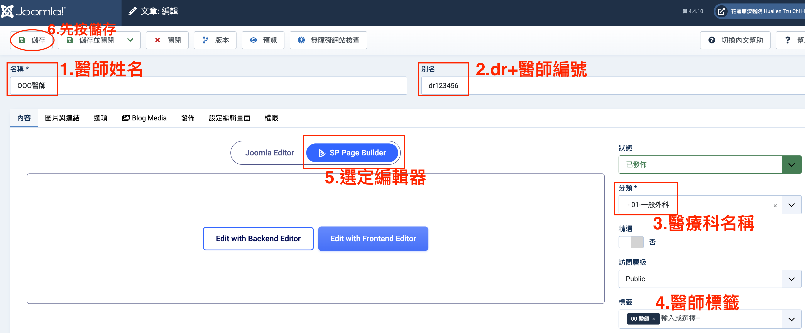
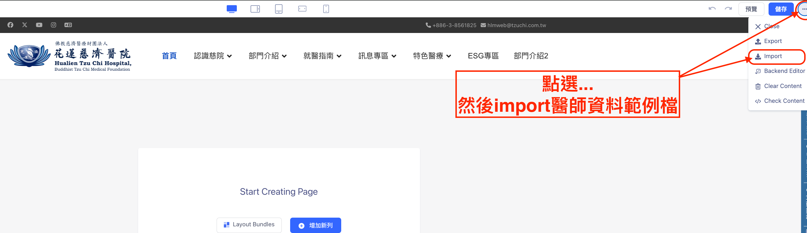
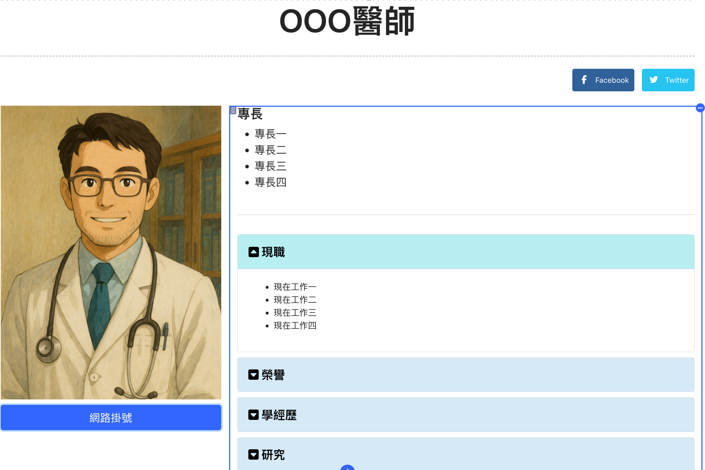

---
## 最新公告衛教文章
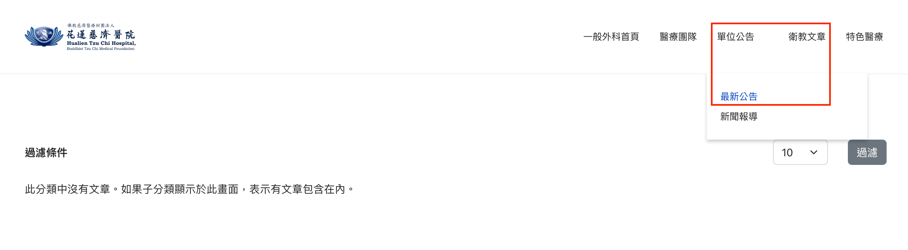

---
## 編輯公告與衛教文章
- 內容->文章->篩選(醫療科別)
- 按下「新建+」 按鈕來進行編輯，最後記得從標籤來決定是「公告」還是「衛教文章」
- 存檔前，請按下「清除格式按鈕」
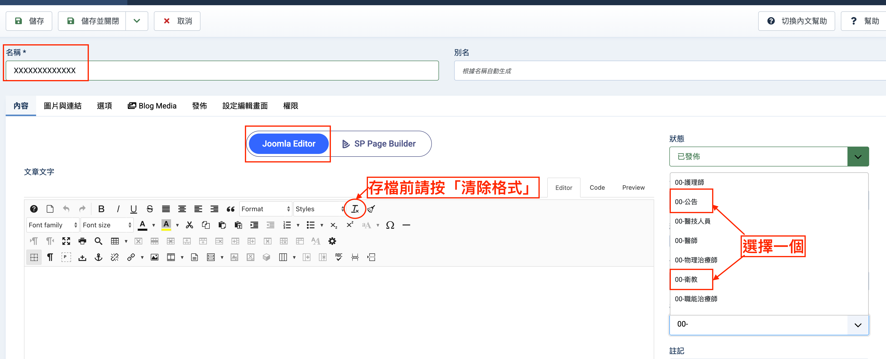

---

## 五大超級重要提醒
1. 請勿直接複製Notes上內容，貼到Joomla文章上。
2. 請勿刪除或編輯不屬於醫務部的文章或媒體檔案內容。
3. 請勿自行按下Joomla版本升級按鈕。
4. 請使用自己帳號編輯，也不要外借帳號供他人使用。
5. 請勿上傳不符合規格尺寸或檔案過大的圖片(可先用faststone軟體編輯圖片)