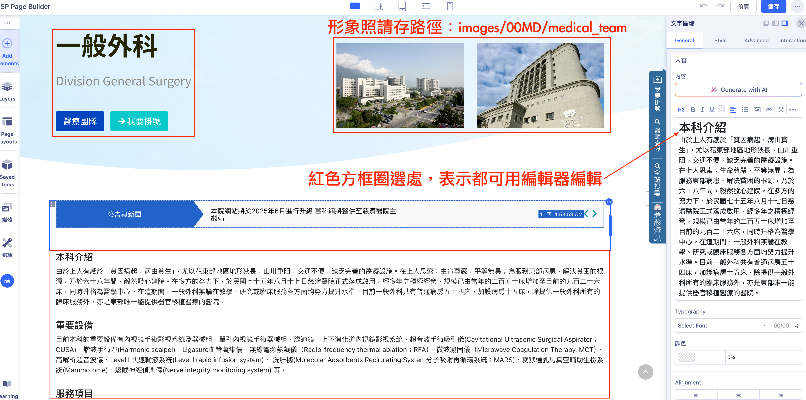

## 目錄

- [導言](#導言)
- [該用哪種編輯器](#該用哪種編輯器)
- [醫療科網首頁範本](#醫療科網首頁範本)
- [醫療科首頁編輯教學](#醫療科首頁編輯教學)
-  [醫療團隊範本](#醫療團隊範本)
- [醫療團隊編輯教學](#醫療團隊編輯教學)
- [最新公告衛教文章](#最新公告衛教文章)
- [公告與衛教文章編輯教學](#公告與衛教文章編輯教學)
- [五大超級重要提醒](#五大超級重要提醒)
- [聯絡窗口](#聯絡窗口)
# 慈院醫療科網整併與維護
---
作者：曾建瑋(慈院公共傳播室)，2025.05.01
## 導言
- 優勢
	- 減少管理成本：單一帳密、節省網站空間、套件更新一致
	- 各科網能即時更新新聞公告
	- 醫師資料顯示與編輯人性化
- 目標
	- 第一階段(醫務部，5/27-6/30)：整併科網(首頁、團隊資料)、封存舊科網資料
	- 第二階段(各醫事單位，6/3-6/15)：依屬性整併或獨立網站
	- 第三階段(各中心，6/16-6/30)：依屬性整併或獨立網站

- 此文件有三大教學重點。系統登入連結是 [花蓮慈院管理後台網址](https://hlmedit.tzuchi.com.tw/hualien/home/administrator/)
	- 更新醫療科首頁
	- 更新醫師資料
	- 發佈醫療科新聞、公告、衛教

---
## 該用哪種編輯器
- 要先確定你要更新的內容，再來決定用的編輯工具。

| 編輯內容   | 編輯工具                       |
| ------ | -------------------------- |
| 醫療科首頁  | SP Page編輯器(元件->SP Page編輯器) |
| 醫師基本資料 | JCE原生編輯器(內容->文章)           |
| 公告     | JCE原生編輯器(內容->文章)           |
| 衛教文章   | JCE原生編輯器(內容->文章)           |

---
## 醫療科網首頁範本

---
## 醫療科首頁編輯教學
- 操作教學影片請點下圖

- 用SP Page編輯器更新醫療科首頁。(元件->SP Page Buider->Pages)

- 篩選分類「醫療科」->點選該科的「前端編輯器」

- 形象照請存路徑：images/00MD/medical_team，照片尺寸：900 * 600px。
- 簡介區塊段落內容可自行調整。
- 編輯內容存檔前，請一定要清除「多餘格式」。

---
## 醫療團隊範本

---
## 醫療團隊編輯教學
- 操作教學影片請點下圖

- 第一種情況：更新既有醫師資料 (以林修賢醫師為例)
	- 內容->文章->篩選->分類(醫療科名稱)->標籤(00-醫師)
	- 用醫師姓名來尋找檔案。
	- 開啟檔案後選->SP Page Builder->Edit with Frontend Editor(再次輸入帳密)
	- 醫師照片路徑：images/00MD/dr/醫師編號.jpg
	- 網路掛號：?dtno=醫師編號
	- 更新醫師資料，存檔前要按下「清除多餘格式按鈕」
	- 確認醫師排列縮圖：從文章去點選「圖片與連結」，確認摘要圖片正確性。
- 提醒1：最後要儲存並且關閉檔案(避免檔案鎖死，他人無法編輯)
- 提醒2：各科醫師照片修圖及上傳工作 (負責：公傳陳安俞)

- 第二種情況：新增醫師資料
	- 內容->文章->篩選->分類(醫療科名稱)->標籤(00-醫師)
	- 按「新建」->名稱(OOO醫師)->別名(dr醫師編號)->分類(醫療科名稱)->標籤(00-醫師)->選「SP PageBuilder」->直接先按「儲存」

- 完成上述步驟後，按「Edit With Frontend Editor」->點選右上角「...」按鈕->Export，將以下[醫師資料範例JSON檔](https://drive.google.com/file/d/1oBwWFhSFFyXtu0lAE-Z4JE9h6cTzBJcY/view?usp=sharing)匯入。

- 匯入檔案後，依照前一階段編修資料方式進行更新後，再存檔退出。
- 提醒：醫師照片統一路徑是images/00MD/dr/ （檔案名稱是dr+醫師編號.jpg）(公傳統一上傳)
- 確認醫師排列縮圖：從文章去點選「圖片與連結」，新增正確的摘要圖片。

---
## 最新公告衛教文章

---
## 公告與衛教文章編輯教學
- 內容->文章->篩選(醫療科別)
- 按下「新建+」 按鈕來進行編輯，最後記得從標籤來決定是「公告」還是「衛教文章」
- 存檔前，請按下「清除格式按鈕」

---
## 五大超級重要提醒
1. 勿直接複製Notes上內容，貼到Joomla文章上。(若貼到院內連結，會導致網站降速或掛掉)
2. 勿刪除或編輯不屬於醫務部的文章或媒體檔案內容。
3. 勿自行按下Joomla版本升級按鈕。
4. 勿借帳號供他人使用。
5. 勿上傳不符合規格尺寸或檔案過大的圖片，圖片命名請用英文或數字(勿用中文)。

---
## 聯絡窗口
- 網站編輯：網管(曾建瑋，分機：15295)
- 團隊照片：美編(陳安俞，分機：15201)